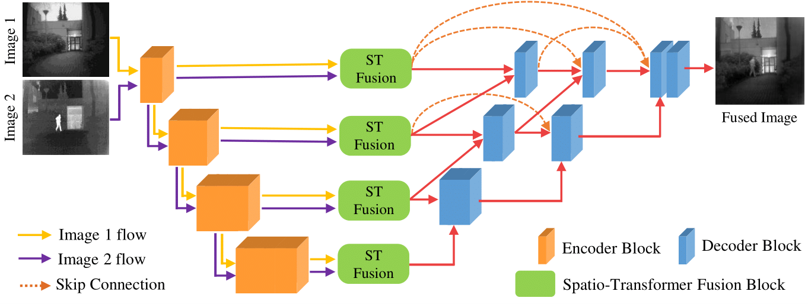

# Image-Fusion-Transformer

[](https://pytorch.org/) 

[Vibashan VS](https://vibashan.github.io/), [Jeya Maria Jose](http://jeya-maria-jose.github.io/research), [Poojan Oza](https://www.linkedin.com/in/poojan-oza-a7b68350/),  [Vishal M Patel](https://scholar.google.com/citations?user=AkEXTbIAAAAJ&hl=en)

[[`Peronal Page`](https://viudomain.github.io/)] [[`ICIP`](https://ieeexplore.ieee.org/abstract/document/9897280)] [[`pdf`](https://arxiv.org/pdf/2107.09011.pdf)] [[`BibTeX`](https://github.com/Vibashan/Image-Fusion-Transformer/blob/main/reference.bib)]

<p align="center">
  
</p>

## Platform
Python 3.7  
Pytorch >=1.0  


## Training Dataset

[MS-COCO 2014](http://images.cocodataset.org/zips/train2014.zip) (T.-Y. Lin, M. Maire, S. Belongie, J. Hays, P. Perona, D. Ramanan, P. Dollar, and C. L. Zitnick. Microsoft coco: Common objects in context. In ECCV, 2014. 3-5.) is utilized to train our auto-encoder network.

[KAIST](https://sites.google.com/view/multispectral/home) (S. Hwang, J. Park, N. Kim, Y. Choi, I. So Kweon, Multispectral pedestrian detection: Benchmark dataset and baseline, in: Proceedings of the IEEE conference on computer vision and pattern recognition, 2015, pp. 1037–1045.) is utilized to train the RFN modules.

The testing datasets are included in "analysis_MatLab".

### Training Command:

```bash 
python train_fusionnet_axial.py
```

### Testing Command:

```bash 
python test_21pairs_axial.py
```

The Fusion results are included in "analysis_MatLab".


If you have any questions about the code, feel free to contact me at vvishnu2@jh.edu.

## Acknowledgement
This codebase is built on top of [RFN-Nest](https://github.com/hli1221/imagefusion-rfn-nest) by [Li Hui](https://github.com/hli1221).

## Citation

If you found IFT useful in your research, please consider starring ⭐ us on GitHub and citing 📚 us in your research!

```bibtex
@inproceedings{vs2022image,
  title={Image fusion transformer},
  author={Vs, Vibashan and Valanarasu, Jeya Maria Jose and Oza, Poojan and Patel, Vishal M},
  booktitle={2022 IEEE International Conference on Image Processing (ICIP)},
  pages={3566--3570},
  year={2022},
  organization={IEEE}
}
```
